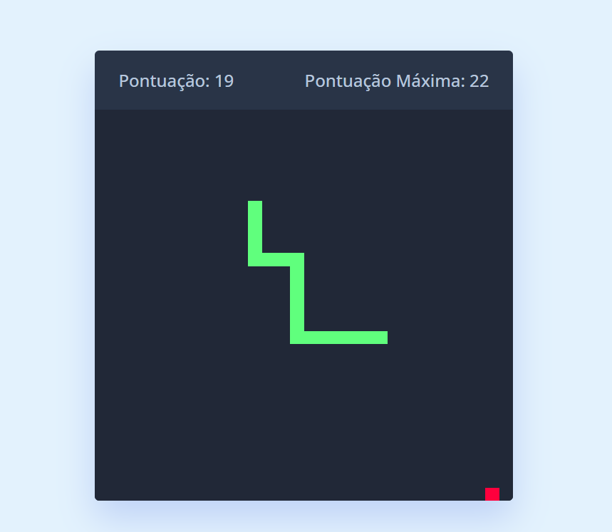

# Day #17

Neste tutorial https://www.youtube.com/watch?v=wM7eMJ26kc8, nele mostra como criar um jogo da cobra usando JavaScript. Este jogo da cobra é totalmente responsivo e possui controles para dispositivos com tela sensível ao toque, permitindo que o usuário use as teclas direcionais ❗️

